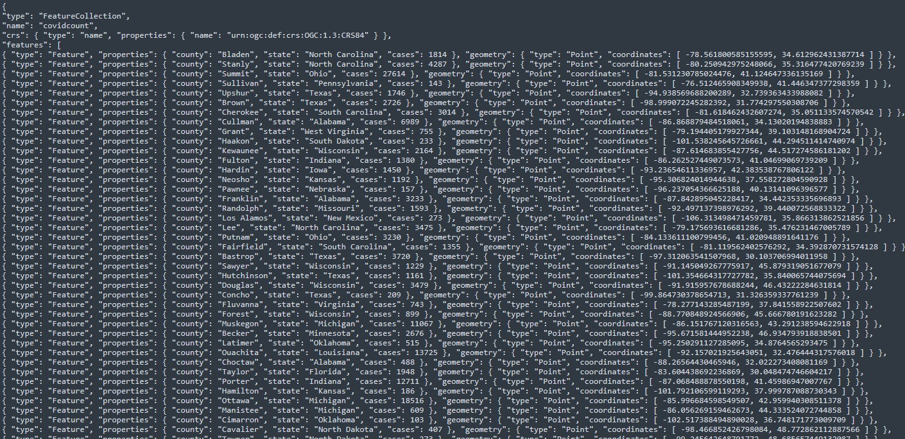
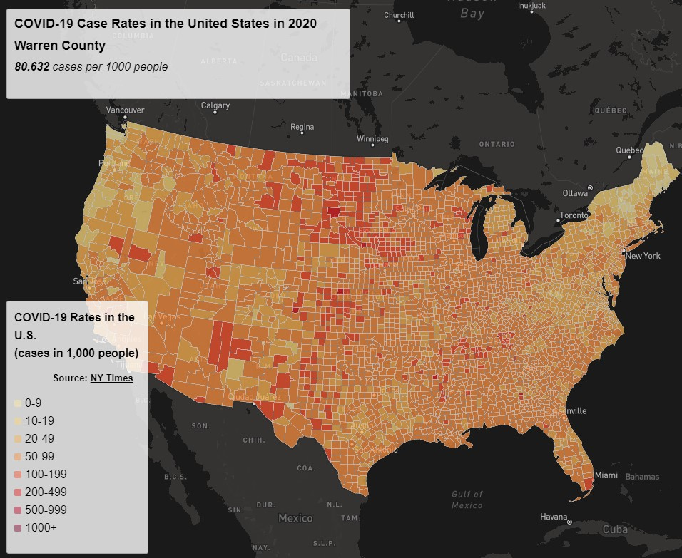
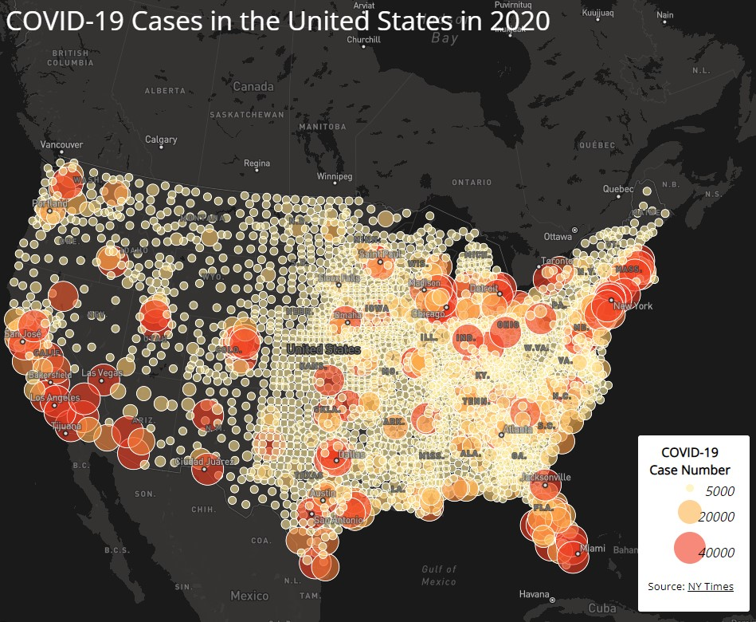

## COVID-19 Maps

In this lab, we created two maps. One depicting the number of cases in different US States and the other depicting rates of cases.

We used data from from [The New York Times](https://github.com/nytimes/covid-19-data/blob/43d32dde2f87bd4dafbb7d23f5d9e878124018b8/live/us-counties.csv)  thatincluded data from cases in 2020. The population data used for calculating the case rates is from the [2018 ACS 5 year estimates](https://data.census.gov/cedsci/table?g=0100000US.050000&d=ACS%205-Year%20Estimates%20Data%20Profiles&tid=ACSDP5Y2018.DP05&hidePreview=true). Both datasets are at the county level which we used the boundary shapefile from [the U.S. Census Bureau](https://www.census.gov/geographies/mapping-files/time-series/geo/carto-boundary-file.html). 

Data was compiled into case count and case rate geojson files to be later processed.

----------

## Map 1
### Choropleth map depicting the rates of COVID-19 per 1,000 people per county

In this map, we can see highly dense counties in a deeper hue of orange, where the highest rates of COVID-19 were in 2020. The lighter shades depict a lower rate. Hovering over the county will display the actual rate per 1,000 people in their repsecitve counties. 

----------

## Map 2
### Proportional map depicting the count of COVID-19 cases per county

In this map, we can see highly dense counties in a deeper hue of red with a larger proportional symbol, where the highest counts of COVID-19 cases were in 2020. The lighter shades with smaller circles depict a lower count of cases. Clicking on the county will display the actual case count in that county.
